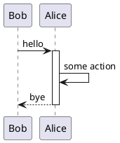
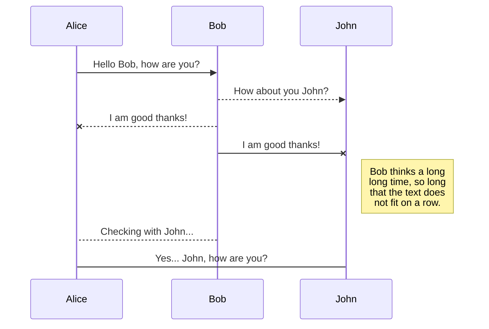

# File types

Plain Text

```txt
// snippets/sample.txt

This file is unformatted plain text

```

Reason

```re
// snippets/sample.re

let hello = () : string => "Hello, World!";

```

Typescript

```ts
// snippets/sample.ts

export function hello(): string {
  return 'Hello World';
}

```

Javascript

```js
// snippets/sample.js

console.log('Hello World');

```

HTML

```html
<!-- snippets/sample.html -->

<h1>Hello world</h1>

```

Python

```py
# snippets/sample.py

print('Hello World')

```

Rust

```rust
// snippets/sample.rs

fn main() {
    println!("Hello World!");
}

```

C++

```cpp
// snippets/sample.cpp

#include <iostream>
using namespace std;

int main()
{
    cout << "Hello, World!";
    return 0;
}

```

Arduino

```cpp
// snippets/sample.ino

#include <iostream>
using namespace std;

int main()
{
    cout << "Hello, World!";
    return 0;
}

```

C

```c
// snippets/sample.c

#include <stdio.h>
int main()
{
   // printf() displays the string inside quotation
   printf("Hello, World!");
   return 0;
}

```

Java

```java
// snippets/sample.java

public class HelloWorld {

    public static void main(String[] args) {
        // Prints "Hello, World" to the terminal window.
        System.out.println("Hello, World");
    }

}

```

Golang

```go
// snippets/sample.go

package main

import "fmt"

func main() {
    fmt.Println("hello world")
}

```

Bash

```sh
# snippets/sample.sh

#!/usr/bin/env bash
print Hello World

```

Shell

```sh
# snippets/sample.sh

#!/usr/bin/env bash
print Hello World

```

Objective C

```objectivec
// snippets/sample.m

#import <Foundation/Foundation.h>

int main(int argc, const char * argv[]) {
    @autoreleasepool {
        NSLog(@"Hello, World!");
    }
    return 0;
}

```

SCSS

```scss
// snippets/sample.scss

.hello {
  .world {
    border: 1px solid red;
  }
}

```

PHP

```php
// snippets/sample.php

<?php
	echo 'Hello, World!';
?>

```

Remote PHP File

```php
// https://raw.githubusercontent.com/astridx/embedme/master/test/fixtures/snippets/sample.php

<?php
	echo 'Hello, World!';
?>

```

C#

```cs
// snippets/sample.cs

using System;
namespace HelloWorld
{
    class Hello
    {
        static void Main()
        {
            Console.WriteLine("Hello World!");

            // Keep the console window open in debug mode.
            Console.WriteLine("Press any key to exit.");
            Console.ReadKey();
        }
    }
}

```

Swift

```swift
// snippets/sample.swift

print("Hello, world!")

```

XML

```xml
<!-- snippets/sample.xml -->

<hello>
    <world>true</world>
</hello>

```

Yaml

```yaml
# snippets/sample.yaml

hello:
  - world

```

JSON

<!-- embedme snippets/sample.json -->

```json
{
  "hello": "world"
}

```

JSON5

```json5
// snippets/sample.json5

{
  hello: 'world',
}

```

Ruby

```rb
# snippets/sample.rb

puts 'Hello, world!'

```

Crystal

```cr
# snippets/sample.cr

puts 'Hello, world!'

```

Kotlin

```kotlin
// snippets/sample.kt

fun main(args: Array<String>) {
    println("Hello World!")
}

```

Scala

```scala
// snippets/sample.scala

object HelloWorld {
  def main(args: Array[String]): Unit = {
    println("Hello, world!")
  }
}

```

Plant UML



Mermaid



Protobuf

```proto
// snippets/sample.proto

syntax = "proto3";

enum Places {
    WORLD = 0;
}

message Hello {
    Places place = 1;
}

```

CMake

```cmake
# snippets/sample.cmake

cmake_minimum_required(VERSION 2.8.9)
project (hello)
add_executable(hello sample.cpp)

```

SQL Script

```sql
-- snippets/sample.sql

SELECT * 
FROM tableUsers
WHERE 1=1
```

Haskell

```hs
-- snippets/sample.hs

main = putStrLn "Hello, world!"

```

JSX

```jsx
// snippets/sample.jsx

console.log('Hello World');

```

TSX

```tsx
// snippets/sample.tsx

export function hello(): string {
  return 'Hello World';
}

```

## Extension-less selection

```sh
# snippets/sample

#!/usr/bin/env bash
print Hello World

```

## Line selection

```cs
// snippets/sample.cs#L6-L13

static void Main()
{
    Console.WriteLine("Hello World!");

    // Keep the console window open in debug mode.
    Console.WriteLine("Press any key to exit.");
    Console.ReadKey();
}
```

## Indented selection

    ```ts
    // snippets/sample.ts
    
    export function hello(): string {
      return 'Hello World';
    }
    
    ```

## Embedme Ignore

<!-- embedme-ignore-next -->

```ts
// snippets/sample.ts
```

## Embedme Ignore alt syntax

<!-- embedme ignore-next -->

```ts
// snippets/sample.ts
```

## Embed with comment

<!-- embedme snippets/sample.ts -->

```ts
export function hello(): string {
  return 'Hello World';
}

```

### Embed with comment and unknown file type

<!-- embedme snippets/sample.json -->

```{.json caption="Some JSON file"}
{
  "hello": "world"
}

```

## Errors

### Empty block

```ts
```

### No file handler

```binary
01001000 01100101 01101100 01101100 01101111 00100000 01010111 01101111 01110010 01101100 01100100
```

### No file extension

```
Ignored block
```

### Bad file format

```ts
// Not a file
```

### Also bad file format

```ts
// also-not-a-file
```

### Missing file

```txt
// this-file-does-not-exist.txt
```

### Contains Codefence

```md
<!-- contains-codefence.md -->
```

### Contains Codefence, but not the embedded lines

```md
<!-- contains-codefence.md#L1-L3 -->

# This markdown document

## Contains a codefence
```

### malformed line numbering

```ts
// snippets/sample.ts#L1-2
```

### missing comment on language embed with no comment support

```json

```

Missing Remote PHP File

```php
// https://raw.githubusercontent.com/astridx/embedme/master/test/fixtures/snippets/this-file-does-not-exist.php
```
